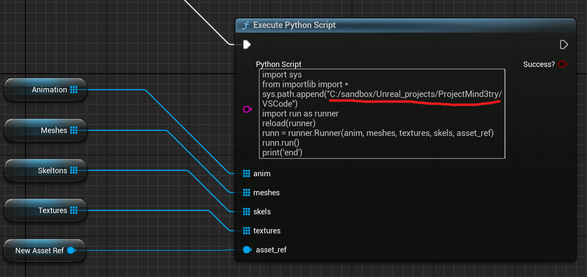

# Mesh Assembler

If you have just come from: [ParentMesh-to-arm](https://github.com/aurorasean/ParentMesh-to-arm)

This is the Unreal Engine parts to re-assemble your model into an actor

## In action!

## How this works

## Setup

Some setup is required in your Unreal project

### Editor plugins

Turn on the Python Scripting plugin in your project!!!

### C++ code, Python code

Copy the contents of [Unreal](/Unreal/) into your project

Change these file names to match your project

- Source/ProjectName
- Source/ProjectName/ProjectName.Build.cs
- Source/ProjectName/ProjectName.cpp
- Source/ProjectName/ProjectName.h
- Source/ProjectName.Target.cs
- Source/ProjectNameEditor.Target.cs

OR copy the changes from inside them to your existing files

### BluePrint Utility Class

[Copy Me to: Content/Utils in your UE project](Blueprint/MakeBase.uasset)

[Copy me to: Content/Base in your UE project](Blueprint/Base.uasset)

### Modify MakeAssetFromSkinned BP

> Change this path to your project path!